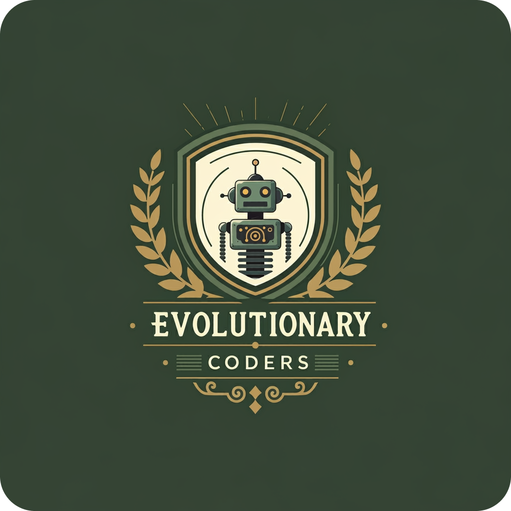

   

# NeuralHunter 🤖🧠

## Descrição do Projeto

NeuralHunter é um robô de combate inteligente desenvolvido para o ambiente Robocode, utilizando técnicas avançadas de aprendizado por reforço e redes neurais. O objetivo principal é criar um agente que aprenda estratégias de combate de forma autônoma.

## Características Principais

- **Aprendizado por Reforço**: Implementa Q-learning para tomada de decisões estratégicas
- **Rede Neural**: Arquitetura neural para processamento de estados e predição de ações
- **Tabela de Lookup (LUT)**: Gerencia valores Q para diferentes estados e ações
- **Adaptabilidade**: Capaz de ajustar suas estratégias durante o combate

## Arquitetura do Sistema

### Componentes Principais

1. **States.java**: Gerenciamento de estados do robô
    - Discretização de direção, distância e ângulo do alvo
    - Normalização de dimensões

2. **Actions.java**: Define as ações possíveis do robô
    - Movimentação 
    - Disparo de projétil

3. **NeuralNetwork.java**: Implementação da rede neural
    - Arquitetura de 3 camadas
    - Algoritmo de backpropagation
    - Função de ativação sigmoid

4. **LookUpTable.java**: Implementação da Q-table
    - Atualização de valores Q
    - Seleção de ações
    - Suporte para estratégias on-policy e off-policy

5. **NeuralHunter.java**: Robô principal
    - Lógica de execução
    - Tratamento de eventos de combate

## Estratégia de Aprendizado

O NeuralHunter utiliza uma abordagem de aprendizado por reforço para melhorar continuamente sua performance:

- Explora diferentes ações inicialmente
- Aprende com resultados de combates
- Ajusta estratégias baseado em recompensas

### Hiperparâmetros

- **Taxa de Aprendizado (α)**: 0.2
- **Fator de Desconto (γ)**: 0.6
- **Camadas Neurais**:
    - Entrada: 4 neurônios
    - Oculta: 30 neurônios
    - Saída: 1 neurônio